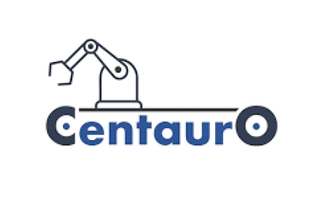
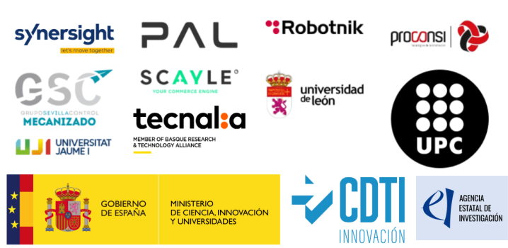

# CENTAURO: Entregable 1.5 - Percepción de Objetos

Este repositorio constituye el Entregable 1.5 del proyecto CENTAURO, enmarcado en el programa 
Misiones Ciencia e Innovación 2023 (TransMisiones) subvencionado por el CDTI y 
la Agencia Estatal de Investigación (MCIN/AEI/10.13039/501100011033).

   
  

## 1. Resumen

<!-- Responsable: UJI -->

<!--Contenido: contexto del proyecto, requerimientos de percepción, objetivos del entregable, estructura del documento -->

El proyecto CENTAURO (Investigación en nuevas tecnologías para impulsar una nueva industria nacional de soluciones autónomas robóticas) 
tiene el objetivo de desarrollar soluciones autónomas robóticas con capacidad de moverse en un entorno productivo para realizar 
distintos tipos de tareas:
* manipulación flexible y versátil
* navegación autónoma en interiores y exteriores
* interacción segura con personas

En estas tareas se requiere la percepción de objetos en el espacio de funcionamiento del robot. En este entregable se
describen componentes hardware y software (dispositivos y algoritmos) así como su integración en el proyecto mediante ROS 2 y Docker.

## 2. Metodología

<!-- Responsable: UJI -->

<!-- Contenido: integración de algoritmos y dispositivos en ROS 2 y Docker -->

Tras casi dos décadas, [ROS (Robot Operating System)](https://www.ros.org/) se ha consolidado como el entorno de referencia para el desarrollo 
de aplicaciones robóticas de código abierto. Su amplio conjunto de herramientas, bibliotecas y funcionalidades lo ha convertido, 
desde su lanzamiento en 2007, en una plataforma esencial para ingenieros y desarrolladores en todo el mundo, desde la fase de prototipado 
hasta soluciones industriales o producto finales.

ROS 2 es la segunda versión del Sistema Operativo para Robots, desarrollado para abordar algunas de las limitaciones de la primera 
y ofrecer mejoras en varios aspectos como, por ejemplo, en lo relativo a la comunicación, compatibilidad con otros sistemas operativos 
o en cuanto al rendimiento.

El proyecto CENTAURO ha apostado por el desarrollo y la integración de componentes en el entorno 
[ROS 2 Jazzy](https://docs.ros.org/en/jazzy/index.html), la versión LTS
(Long Time Support) lanzada en Mayo de 2024 con soporte garantizado hasta el fin del proyecto (Mayo 2029).

Para facilitar el intercambio y la integración de software se usarán [contenedores](https://es.wikipedia.org/wiki/Contenedorizaci%C3%B3n_(inform%C3%A1tica)) 
(unidades estandarizadas que empaquetan una aplicación junto con todas sus dependencias). 
[Docker](https://docs.docker.com/) es una plataforma de código abierto que automatiza el despliegue 
de aplicaciones dentro de contenedores de software, proporcionando una capa adicional de abstracción y automatización 
de virtualización a nivel de sistema operativo. El entorno de ejecución de los contenedores puede configurarse para
[acceder a dispositivos hardware](https://docs.docker.com/engine/containers/run/#runtime-privilege-and-linux-capabilities), 
seleccionando adecuadamente los privilegios y permisos de los procesos.

## 3. Repositorios de algoritmos

Responsable: UJI, Synersight y UPC

Contenido: algoritmos y métodos investigados en la actividad 1

* [Algoritmos](Algoritmos/)

## 4. Repositorios de dispositivos

Responsable: UJI, PAL Robotics y SC

Contenido: dispositivos analizados en la actividad 1

* [Dispositivos](Dispositivos/)

## 5. Conclusiones

Responsable: UJI, PAL Robotics y UPC

Contenido: recapitulación y valoración del trabajo

## 6. Referencias

<!-- Responsable: UJI -->

<!-- Contenido: enlaces de interés -->

* [Docker Documentation](https://docs.docker.com/)
* [ROS 2 Documentation: Jazzy](https://docs.ros.org/en/jazzy/index.html)
